# 🛡️ Enterprise Cybersecurity Laboratories Monorepo Ecosystem

[](https://github.com/toprakahmetaydogmus/cybersecurity-ecosystem/releases)
[](LICENSE)
[](https://github.com/toprakahmetaydogmus/cybersecurity-ecosystem/actions)
[](#)
[](#)
[](#)

Developer: **Toprak Ahmet Aydoğmuş**

---

## 🎯 1. Executive Summary
This monorepo is the central parent repository containing **20 fully tested, production-grade cybersecurity laboratory projects** spanning every critical discipline of modern information security:
- **Active Directory & Identity Defense** (AD CS ESC1-ESC8, Kerberoasting)
- **SOC / SIEM Detection Engineering** (Wazuh, Elastic, Sigma rule evaluation)
- **Cloud Security Hardening** (AWS IAM & CIS Foundations Benchmark)
- **Cyber Threat Intelligence (CTI)** (STIX 2.1 pipeline & threat feeds)
- **Malware Analysis & Sandbox Triage** (PE header parsing, Shannon entropy & YARA rules)
- **API Security** (OWASP API Top 10, BOLA / IDOR testbeds)
- **Industrial Control Systems (ICS/SCADA)** (Modbus/TCP telemetry & Snort inspection)
- **Purple Teaming & MITRE ATT&CK Mapping** (Automated adversary emulation)
- **DevSecOps Security Gates** (Gitleaks, Semgrep, Trivy SAST/DAST)
- **Network Traffic Forensics** (DPI, DNS tunneling & C2 beacon detection)
- **Kubernetes Runtime Security** (Falco eBPF runtime engines & container hardening)
- **Digital Forensics & Incident Response (DFIR)** (Memory artifact supertimelines)
- **Enterprise PKI & mTLS** (Hierarchical CA & automated mutual TLS engine)
- **Wireless Security** (WPA3 Enterprise & Rogue AP detection)
- **Zero Trust Microsegmentation** (WireGuard mesh & nftables enforcement)
- **Binary Security Mitigations** (Canary, NX, PIE, RELRO, ASLR auditing)
- **IoT & Embedded Firmware Security** (RootFS extraction & binary security auditing)
- **SOAR Phishing Automation** (RFC 822 parsing, SPF/DKIM/DMARC verification & auto-blocklist)
- **Distributed Honeynet Deception** (Cowrie/Dionaea sensor telemetry & threat profiling)
- **Post-Quantum Cryptography** (NIST FIPS 203 ML-KEM-768 & FIPS 204 ML-DSA benchmarks)

---

## 🏗️ 2. Monorepo Architecture Diagram

```mermaid
graph TD
    Master["master_lab_runner.py - Central CLI"] --> Lab01["01: AD Identity & AD CS Defense"]
    Master --> Lab02["02: SOC SIEM & Sigma Rules Engine"]
    Master --> Lab03["03: AWS Cloud Security & IAM Audit"]
    Master --> Lab04["04: STIX 2.1 CTI Threat Pipeline"]
    Master --> Lab05["05: PE Malware Static Triage & Entropy"]
    Master --> Lab06["06: OWASP API Top 10 BOLA Testbed"]
    Master --> Lab07["07: OT/ICS Modbus SCADA Hunter"]
    Master --> Lab08["08: Purple Team MITRE ATT&CK Matrix"]
    Master --> Lab09["09: DevSecOps CI/CD Security Gate"]
    Master --> Lab10["10: DPI PCAP Network Threat Hunt"]
    Master --> Lab11["11: K8s Falco eBPF Runtime Defense"]
    Master --> Lab12["12: DFIR Memory Artifact Supertimeline"]
    Master --> Lab13["13: Enterprise PKI Hierarchy & mTLS"]
    Master --> Lab14["14: Wireless WPA3 Enterprise & Rogue AP"]
    Master --> Lab15["15: Zero Trust Microsegmentation Mesh"]
    Master --> Lab16["16: Binary Mitigations & Memory Safety"]
    Master --> Lab17["17: Embedded IoT Firmware Security"]
    Master --> Lab18["18: SOAR Automated Phishing Triage"]
    Master --> Lab19["19: Distributed Honeynet Sensor Profiler"]
    Master --> Lab20["20: NIST Post-Quantum Cryptography"]
```



---

## 🚀 3. Quick Start & Execution

```bash
# 1. Clone the monorepo
git clone https://github.com/toprakahmetaydogmus/cybersecurity-ecosystem.git
cd cybersecurity-ecosystem

# 2. Run all 20 laboratory tests with a single command
python master_lab_runner.py --test-all

# 3. Launch the interactive CLI menu
python master_lab_runner.py
```

---

## 📊 4. 20 Laboratory Catalog & Technical Scope

| # | Directory / Repository | Domain | Core Features & Security Engines |
|---|---|---|---|
| 01 | `labs/01-ad-identity-defense` | Identity & AD | AD CS ESC1-ESC8 Auditor & Kerberoasting Detection Engine |
| 02 | `labs/02-soc-siem-detection-pipeline` | SOC & SIEM | Wazuh, Sigma Rule Evaluation Engine & Real-time Web GUI |
| 03 | `labs/03-cloudsec-aws-audit` | Cloud Security | CIS AWS Foundations v1.4 Benchmark Auditor & IAM Policy Checker |
| 04 | `labs/04-threatintel-misp-opencti` | Threat Intel | STIX 2.1 Bundle Normalizer & Web Threat Visualizer |
| 05 | `labs/05-sandbox-malware-triage` | Malware Analysis | PE Header Parser, Shannon Entropy & YARA Rule Engine |
| 06 | `labs/06-api-security-bola-testbed` | API Security | FastAPI OWASP BOLA / IDOR Testing & Exploitation Playground |
| 07 | `labs/07-ics-scada-modbus-hunter` | OT / ICS Security | Modbus/TCP APU Frame Analyzer & Snort ICS Detection Rules |
| 08 | `labs/08-atomic-mitre-telemetry` | Purple Teaming | Synthetic Telemetry Generator & ATT&CK Matrix Heatmap |
| 09 | `labs/09-devsecops-ci-cd-pipeline` | DevSecOps | SAST AST Engine, Secret Scanner & Automated SARIF Exporter |
| 10 | `labs/10-network-traffic-hunt-arkime` | Network Forensics | Deep Packet Inspection, DNS Tunneling & C2 Beaconing Detector |
| 11 | `labs/11-k8s-runtime-security-falco` | Container Security | Falco eBPF Runtime Engine & ServiceAccount Token Defense |
| 12 | `labs/12-dfir-memory-artifact-pipeline` | DFIR Forensics | Supertimeline Engine & Process Tree Anomaly Detector |
| 13 | `labs/13-enterprise-pki-mtls` | Cryptography / PKI | Root CA -> Intermediate CA -> Leaf mTLS Automated Validator |
| 14 | `labs/14-wireless-wpa3-rogue-hunter` | Wireless Security | 802.11 Beacon Analyzer, Evil Twin & WPA3 Downgrade Hunter |
| 15 | `labs/15-zerotrust-microseg-wireguard` | Zero Trust | WireGuard Mesh Topology & NFTables Microsegmentation Engine |
| 16 | `labs/16-binary-security-mitigations` | Binary Security | ELF Hardening (Canary, NX, PIE, RELRO, ASLR) Auditor |
| 17 | `labs/17-iot-firmware-emulation` | IoT Security | RootFS Extraction Auditor & Embedded Secret Key Checker |
| 18 | `labs/18-soar-phishing-automation` | SOAR Automation | RFC 822 Email Parser, SPF/DMARC Evaluator & Auto-Blocklist |
| 19 | `labs/19-distributed-t-pot-honeynet` | Deception Security | Cowrie/Dionaea Telemetry Aggregator & Attacker Profiler |
| 20 | `labs/20-pqc-postquantum-testbed` | Quantum Crypto | NIST FIPS 203 ML-KEM-768 & FIPS 204 ML-DSA Benchmark Suite |

---

## 📜 5. License
This monorepo and all associated submodules are licensed under the [MIT License](LICENSE).  
Developer: **Toprak Ahmet Aydoğmuş**.
