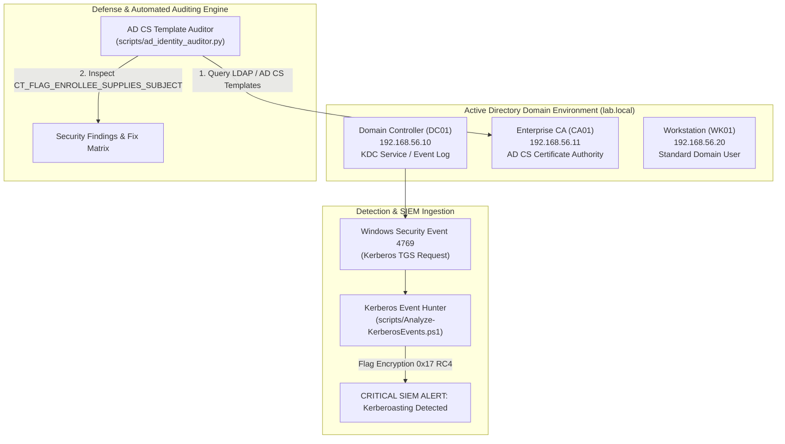

# 🛡️ Active Directory & Identity Defense Lab (AD CS ESC1-ESC8 & Kerberoasting)

[](LICENSE)
[](https://github.com/toprakahmetaydogmus/01-ad-identity-defense/actions)
[](https://attack.mitre.org/)
[](#)
[](#)
[](#)

Geliştirici: **Toprak Ahmet Aydoğmuş**

---

## 📌 1. Yönetici Özeti ve Tehdit Modeli (Executive Summary)
Kurumsal ağların omurgasını oluşturan Microsoft Active Directory (AD) ortamlarında kimlik güvenliği, modern fidye yazılımı ve gelişmiş kalıcı tehdit (APT) aktörlerinin birincil hedefidir. Bu laboratuvar projesi; Active Directory altyapılarında en sık istismar edilen iki kritik zafiyet sınıfını derinlemesine ele alır:

1. **Active Directory Certificate Services (AD CS) Yanlış Yapılandırmaları (ESC1 - ESC8):** Sertifika şablonlarında `CT_FLAG_ENROLLEE_SUPPLIES_SUBJECT` bayrağının etkin olması nedeniyle düşük yetkili kullanıcıların Domain Administrator haklarına eskalasyonu (SAN Impersonation).
2. **Kerberoasting Saldırıları:** Servis Hesaplarına (SPN) ait TGS biletlerinin çevrimdışı hash kırma (offline brute-force) amacıyla zayıf RC4 (`0x17`) şifreleme ile talep edilmesi.

---

## 🏗️ 2. Mimari ve Telemetri Akışı (Architecture Diagram)



---

## 📁 3. Dizin Yapısı ve Dosya Haritası

```text
01-ad-identity-defense/
├── .github/workflows/
│   └── ci.yml                      # Otomatik CI/CD test kalitesi boru hattı
├── rules/
│   ├── sigma_adcs_esc1.yml         # AD CS ESC1 tespit Sigma kuralı
│   └── sigma_kerberoasting_rc4.yml # RC4 Kerberoasting tespit Sigma kuralı
├── scripts/
│   ├── ad_identity_auditor.py      # Çapraz platform Python AD CS denetçisi
│   ├── Audit-ADCS-Templates.ps1    # PowerShell tabanlı AD CS şablon analizörü
│   └── Analyze-KerberosEvents.ps1  # Event ID 4769 Kerberoasting analizörü
├── tests/
│   ├── __init__.py
│   └── test_core.py                # Otomatik Python unit test paketi
├── .gitignore                      # Standart güvenlik laboratuvarı gitignore
├── LICENSE                         # MIT Lisansı (Toprak Ahmet Aydoğmuş)
├── README.md                       # Kapsamlı laboratuvar dokümantasyonu
└── Vagrantfile                     # Sanal laboratuvar altyapı kodu
```

---

## ⚙️ 4. Sistem Gereksinimleri ve Önkoşullar
- **İşletim Sistemi:** Windows 10/11, Ubuntu 20.04+, macOS Sonoma
- **Python:** 3.10 veya üzeri (Ek kütüphane gerektirmez, standard library)
- **PowerShell:** 5.1 veya PowerShell Core 7.x
- **İsteğe Bağlı:** Vagrant 2.3+ & VirtualBox 7.x (Sanal makineler için)

---

## 🚀 5. Adım Adım Kurulum ve Hızlı Başlangıç (Quickstart)

```bash
# 1. Depoyu klonlayın
git clone https://github.com/toprakahmetaydogmus/01-ad-identity-defense.git
cd 01-ad-identity-defense

# 2. Otomatik doğrulama ve unit testleri çalıştırın
python -m unittest discover -s tests/ -p "test_*.py"

# 3. Python AD CS Denetim Motorunu çalıştırın
python scripts/ad_identity_auditor.py
```

---

## 🔬 6. Simüle Tehdit Senaryosu ve Tespit Çıktısı

### Senaryo 1: AD CS ESC1 Yetki Yükseltme Tespiti
```text
$ python scripts/ad_identity_auditor.py
[*] Running AD Identity Security Audit...
[!] AD CS Audit Result: Template 'WebUser-ESC1' flagged as CRITICAL (ESC1 Detected).
```

### Senaryo 2: Kerberoasting RC4 Şifreleme Düşürme Tespiti
```text
$ powershell .\scripts\Analyze-KerberosEvents.ps1
[*] Kerberos Event 4769 Analyzer Initialized...
[!] [ALERT - KERBEROASTING SUSPECTED]
    Source IP:    10.10.10.99
    Target SPN:   MSSQLSvc/sql01.lab.local:1433
    User:         attacker_sim
    Encryption:   RC4-HMAC (0x17) - Potential ticket extraction for offline cracking!
```

---

## 📊 7. MITRE ATT&CK & CIS Benchmark Eşleme Tablosu

| MITRE ATT&CK ID | Teknik Adı | Taktik | Tespit Mekanizması | CIS / Sertleştirme Önlemi |
|---|---|---|---|---|
| **T1649** | Steal or Forge Authentication Certificates | Credential Access | WinEvent 4887 & Template Flag Kontrolü | `CT_FLAG_ENROLLEE_SUPPLIES_SUBJECT` kapatılmalı, Onay Mekanizması açılmalı. |
| **T1558.003** | Kerberoasting (TGS Ticket Extraction) | Credential Access | WinEvent 4769 Encryption `0x17` Filtresi | SPN hesaplarında 25+ karakter parola ve AES-256 zorunluluğu, gMSA kullanımı. |

---

## 📜 8. Lisans ve Gizlilik Beyanı
Bu laboratuvar [MIT Lisansı](LICENSE) altında lisanslanmıştır. Yazar: **Toprak Ahmet Aydoğmuş**.  
*Tüm ağ adresleri RFC 1918 (`10.10.x.x`, `192.168.56.x`) ve RFC 5737 dokümantasyon bloklarına uygundur. Gerçek üretim verisi içermez.*
