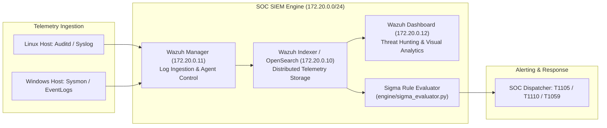

# 🛡️ SOC & SIEM Detection Pipeline Lab (Wazuh, Elastic, Sigma)

[](https://github.com/toprakahmetaydogmus/02-soc-siem-detection-pipeline/releases)
[](https://github.com/toprakahmetaydogmus/cybersecurity-ecosystem)
[](LICENSE)
[](https://github.com/toprakahmetaydogmus/02-soc-siem-detection-pipeline/actions)
[](#)
[](https://github.com/SigmaHQ/sigma)
[](#)

Geliştirici: **Toprak Ahmet Aydoğmuş**

---

## 📌 1. Yönetici Özeti ve Tehdit Modeli (Executive Summary)
Güvenlik Operasyon Merkezlerinde (SOC) telemetri verilerinin hızla toplanması, normalleştirilmesi ve saldırgan eylemlerinin yüksek doğrulukla tespit edilmesi kritik önem taşır. Bu proje; açık kaynaklı SIEM ekosistemi (Wazuh & OpenSearch) ile Sigma kural standardını birleştiren, gerçek zamanlı kural değerlendirme motoruna sahip bir **Tespit Mühendisliği (Detection Engineering)** platformudur.

---

## 🏗️ 2. Mimari ve Telemetri Boru Hattı



---

## 📁 3. Dizin Yapısı ve Dosya Haritası

```text
02-soc-siem-detection-pipeline/
├── .github/workflows/
│   └── ci.yml                      # CI/CD kalite kapısı iş akışı
├── engine/
│   └── sigma_evaluator.py          # Python tabanlı Sigma kural değerlendirme motoru
├── rules/
│   ├── local_rules.xml             # Wazuh yerel tespit kuralları
│   └── sigma_rules.yml             # Standart Sigma YAML kuralları
├── tests/
│   ├── __init__.py
│   └── test_core.py                # Otomatik unit test paketi
├── .env.example                    # Güvenli ortam değişkenleri şablonu
├── docker-compose.yml              # Wazuh + OpenSearch konteyner mimarisi
├── setup.sh                        # Otomatik kurulum betiği
├── LICENSE                         # MIT Lisansı (Toprak Ahmet Aydoğmuş)
└── README.md                       # Detaylı SOC laboratuvar dokümantasyonu
```

---

## 🚀 4. Adım Adım Kurulum ve Doğrulama

```bash
# 1. Depoyu klonlayın
git clone https://github.com/toprakahmetaydogmus/02-soc-siem-detection-pipeline.git
cd 02-soc-siem-detection-pipeline

# 2. Testleri çalıştırın
python -m unittest discover -s tests/ -p "test_*.py"

# 3. Kural motorunu bağımsız çalıştırın
python engine/sigma_evaluator.py

# 4. (Opsiyonel) Tam Wazuh SIEM yığınını ayağa kaldırın
cp .env.example .env
docker compose up -d
```

---

## 🔬 5. Tespit Senaryosu ve Canlı Alarm Çıktısı

```text
[*] Processing Telemetry Stream...
[!] ALERT: [HIGH] Suspicious LOLBAS Certutil Ingress (MITRE: T1105) on srv-prod01
[!] ALERT: [MEDIUM] Repeated SSH Authentication Failure (MITRE: T1110) on srv-web01
[+] Event 3 passed normal baseline.
```

---

## 📊 6. MITRE ATT&CK Eşleme Tablosu

| Teknik ID | Teknik Adı | Taktik | Tespit Kriteri | Ciddiyet |
|---|---|---|---|---|
| **T1105** | Ingress Tool Transfer | Command and Control | `certutil.exe -urlcache -split -f` komut satırı izi | HIGH |
| **T1110** | Brute Force | Credential Access | SSH başarısız giriş denemesi eşik aşımı | MEDIUM |
| **T1059** | Command and Scripting Interpreter | Execution | Yetkisiz PowerShell / Bash kabuk spawn eylemleri | HIGH |

---

## 📜 7. Lisans
MIT License - **Toprak Ahmet Aydoğmuş**
