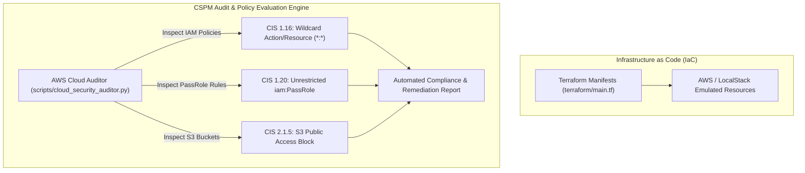

# ☁️ Cloud Security AWS IAM & CIS Hardening Lab

[](https://github.com/toprakahmetaydogmus/03-cloudsec-aws-audit/releases)
[](https://github.com/toprakahmetaydogmus/cybersecurity-ecosystem)
[](LICENSE)
[](https://github.com/toprakahmetaydogmus/03-cloudsec-aws-audit/actions)
[](#)
[](#)

Geliştirici: **Toprak Ahmet Aydoğmuş**

---

## 📌 1. Yönetici Özeti ve Tehdit Modeli (Executive Summary)
Bulut ortamlarındaki veri sızıntılarının %80'inden fazlası yanlış yapılandırılmış kimlik izinleri (Overly Permissive IAM) ve herkese açık depolama alanlarından (Public S3 Buckets) kaynaklanmaktadır. Bu laboratuvar, **CIS AWS Foundations Benchmark** standartlarına uygunluğu denetleyen ve Terraform ile güvenli bulut mimarileri kuran bir Cloud Security Posture Management (CSPM) aracıdır.

---

## 🏗️ 2. Mimari Şema



---

## 📁 3. Dizin Yapısı ve Dosya Haritası

```text
03-cloudsec-aws-audit/
├── .github/workflows/
│   └── ci.yml                      # CI/CD test doğrulama iş akışı
├── scripts/
│   └── cloud_security_auditor.py   # Python tabanlı AWS IAM ve S3 denetçisi
├── terraform/
│   └── main.tf                     # Sertleştirilmiş S3 ve IAM kaynak şablonları
├── tests/
│   ├── __init__.py
│   └── test_core.py                # Otomatik unit test paketi
├── LICENSE                         # MIT Lisansı (Toprak Ahmet Aydoğmuş)
└── README.md                       # Detaylı bulut güvenliği dokümantasyonu
```

---

## 🚀 4. Hızlı Başlangıç & Test

```bash
# 1. Depoyu klonlayın
git clone https://github.com/toprakahmetaydogmus/03-cloudsec-aws-audit.git
cd 03-cloudsec-aws-audit

# 2. Testleri çalıştırın
python -m unittest discover -s tests/ -p "test_*.py"

# 3. Bulut güvenlik denetim motorunu çalıştırın
python scripts/cloud_security_auditor.py
```

---

## 🔬 5. Denetim Raporu Çıktısı

```text
[*] Starting AWS Cloud Security Configuration Audit...
[+] Audit Finished. Found 3 security findings:

  [CRITICAL] [CIS-AWS-1.16] VulnerableDevRolePolicy: IAM Policy grants wildcard Action and Resource (*:*). Violates Least Privilege.
  [CRITICAL] [CIS-AWS-2.1.5] s3://customer-records-raw: S3 Public Access Block is disabled. Bucket is potentially exposed.
  [MEDIUM]   [CIS-AWS-2.1.1] s3://customer-records-raw: Default server-side encryption (KMS/AES256) is not enforced.
```

---

## 📜 6. Lisans
MIT License - **Toprak Ahmet Aydoğmuş**
