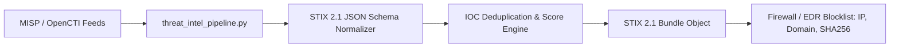

# Cyber Threat Intelligence STIX 2.1 Pipeline

[](LICENSE)
[](https://github.com/toprakahmetaydogmus/04-threatintel-misp-opencti/actions)
[](#)

Geliştirici: **Toprak Ahmet Aydoğmuş**

OpenCTI ve MISP platformları arasında STIX 2.1 formatında otomatik IOC ayrıştırma, güvenilirlik puanlama ve dinamik firewall IP bloklama listesi (EDR feed) üreten CTI boru hattı.

---

## 🏗️ Veri Akış Mimarisi



---

## ⚡ Hızlı Başlangıç

```bash
git clone https://github.com/toprakahmetaydogmus/04-threatintel-misp-opencti.git
cd 04-threatintel-misp-opencti

python scripts/threat_intel_pipeline.py
```

---

## 📜 Lisans
MIT License - **Toprak Ahmet Aydoğmuş**
