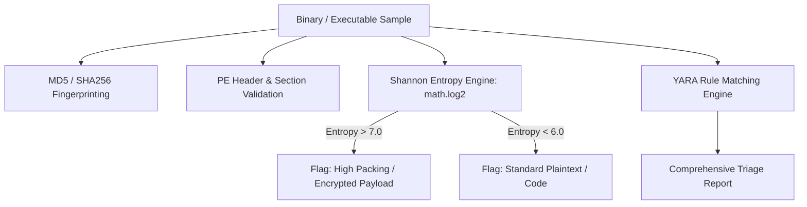

# Malware Static & Dynamic Triage Pipeline (Entropy & YARA)

[](https://github.com/toprakahmetaydogmus/05-sandbox-malware-triage/releases)
[](https://github.com/toprakahmetaydogmus/cybersecurity-ecosystem)
[](LICENSE)
[](https://github.com/toprakahmetaydogmus/05-sandbox-malware-triage/actions)
[](#)

Geliştirici: **Toprak Ahmet Aydoğmuş**

Zararlı yazılım analizinde kullanılan statik triyaj motoru; PE header analizi, **Shannon Entropisi** hesaplama ve YARA kural eşleme motorunu içerir.

---

## 🏗️ Analiz Metodolojisi



---

## ⚡ Hızlı Başlangıç

```bash
git clone https://github.com/toprakahmetaydogmus/05-sandbox-malware-triage.git
cd 05-sandbox-malware-triage

python scripts/pe_static_triage.py
```

---

## 📜 Lisans
MIT License - **Toprak Ahmet Aydoğmuş**
