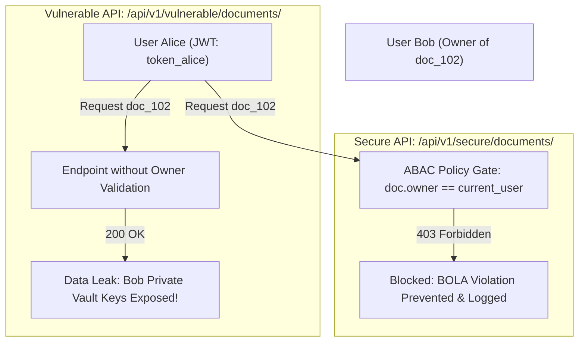

# 🌐 API Security & Broken Object Level Auth (BOLA / IDOR) Testbed

[](LICENSE)
[](https://github.com/toprakahmetaydogmus/06-api-security-bola-testbed/actions)
[](https://owasp.org/API-Security/)
[](#)

Geliştirici: **Toprak Ahmet Aydoğmuş**

---

## 📌 1. Yönetici Özeti ve Tehdit Modeli (Executive Summary)
OWASP API Security Top 10 listesinin 1 numarasında yer alan **BOLA (Broken Object Level Authorization / IDOR)**, bir kullanıcının yetkisiz şekilde başka bir kullanıcıya ait nesne ID'sini (örneğin `/api/v1/documents/doc_102`) çağırarak verilere erişmesidir. Bu testbed, zafiyetin oluşum mekanizmasını ve **Attribute-Based Access Control (ABAC)** ile nasıl engellendiğini kanıtlayan çalışır bir laboratuvardır.

---

## 🏗️ 2. Zafiyetli ve Güvenli API Mimarisi



---

## 📁 3. Dizin Yapısı

```text
06-api-security-bola-testbed/
├── .github/workflows/
│   └── ci.yml                      # CI/CD test iş akışı
├── app/
│   └── main.py                     # FastAPI zafiyetli ve güvenli API endpoint'leri
├── tests/
│   ├── __init__.py
│   └── test_core.py                # BOLA ve ABAC yetkilendirme unit testleri
├── LICENSE                         # MIT Lisansı (Toprak Ahmet Aydoğmuş)
└── README.md                       # API güvenlik laboratuvarı dokümantasyonu
```

---

## 🚀 4. Hızlı Başlangıç & Test

```bash
git clone https://github.com/toprakahmetaydogmus/06-api-security-bola-testbed.git
cd 06-api-security-bola-testbed

# Unit test paketini çalıştırın
python -m unittest discover -s tests/ -p "test_*.py"
```

---

## 📜 5. Lisans
MIT License - **Toprak Ahmet Aydoğmuş**
