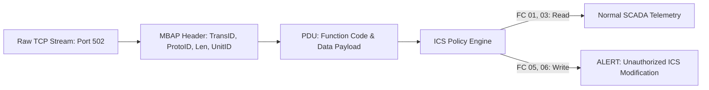

# OT / ICS / SCADA Modbus Telemetry & Snort Threat Hunter

[](https://github.com/toprakahmetaydogmus/07-ics-scada-modbus-hunter/releases)
[](https://github.com/toprakahmetaydogmus/cybersecurity-ecosystem)
[](LICENSE)
[](https://github.com/toprakahmetaydogmus/07-ics-scada-modbus-hunter/actions)
[](#)

Geliştirici: **Toprak Ahmet Aydoğmuş**

Endüstriyel Kontrol Sistemleri (ICS) ve SCADA ortamlarında Modbus/TCP APU çerçevelerini ayrıştıran ve yetkisiz fonksiyon kodlarını (Coil yazma `0x05`, Register değiştirme `0x06`) yakalayan analiz motoru.

---

## 🏗️ Modbus APU Ayrıştırma Mimarisi



---

## ⚡ Hızlı Başlangıç

```bash
git clone https://github.com/toprakahmetaydogmus/07-ics-scada-modbus-hunter.git
cd 07-ics-scada-modbus-hunter

python scripts/ics_traffic_analyzer.py
```

---

## 📜 Lisans
MIT License - **Toprak Ahmet Aydoğmuş**
