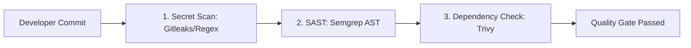

# Automated DevSecOps CI/CD Security Gate (Gitleaks, Semgrep, Trivy)

[](https://github.com/toprakahmetaydogmus/09-devsecops-ci-cd-pipeline/releases)
[](https://github.com/toprakahmetaydogmus/cybersecurity-ecosystem)
[](LICENSE)
[](https://github.com/toprakahmetaydogmus/09-devsecops-ci-cd-pipeline/actions)
[](#)

Geliştirici: **Toprak Ahmet Aydoğmuş**

Kaynak kod statik analizi (SAST), gizli bilgi taraması (Secret Scanning) ve bağımlılık açıklarını denetleyen yerel ve CI/CD güvenlik motoru.

---

## 🏗️ Güvenlik Kapısı Akışı



---

## ⚡ Hızlı Başlangıç

```bash
git clone https://github.com/toprakahmetaydogmus/09-devsecops-ci-cd-pipeline.git
cd 09-devsecops-ci-cd-pipeline

python scripts/devsecops_runner.py
```

---

## 📜 Lisans
MIT License - **Toprak Ahmet Aydoğmuş**
