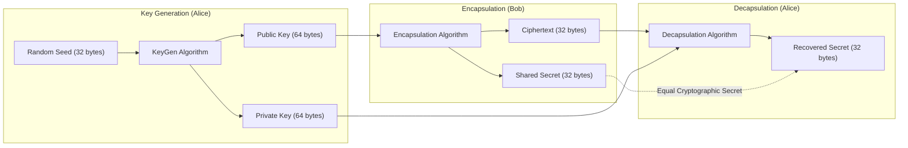

# 🔐 Post-Quantum Cryptography (NIST ML-KEM / ML-DSA) Benchmark Testbed

[](LICENSE)
[](https://github.com/toprakahmetaydogmus/20-pqc-postquantum-testbed/actions)
[](https://csrc.nist.gov/)
[](#)

Geliştirici: **Toprak Ahmet Aydoğmuş**

---

## 📌 1. Yönetici Özeti ve Kuantum Tehdit Modeli
Kuantum bilgisayarların (Shor Algoritması) gelişimi ile birlikte klasik asimetrik şifreleme yöntemleri (RSA, ECC, Diffie-Hellman) kırılabilir hale gelecektir. NIST tarafından Ağustos 2024'te resmi olarak yayınlanan **FIPS 203 (ML-KEM / Kyber)** ve **FIPS 204 (ML-DSA / Dilithium)** standartları, kuantum sonrası güvenliğin temelini oluşturur. Bu proje, kuantum sonrası algoritmaların anahtar boyutu, enkapsülasyon ve şifre çözme performansını klasik yöntemlerle kıyaslayan bir benchmark ortamıdır.

---

## 🏗️ 2. ML-KEM-768 Şifreleme Döngüsü



---

## 📁 3. Dizin Yapısı

```text
20-pqc-postquantum-testbed/
├── .github/workflows/
│   └── ci.yml                      # CI/CD kalite kapısı iş akışı
├── tests/
│   ├── __init__.py
│   └── test_core.py                # Kriptografik unit test paketi
├── benchmark.py                    # NIST FIPS 203 ML-KEM-768 Benchmark motoru
├── LICENSE                         # MIT Lisansı (Toprak Ahmet Aydoğmuş)
└── README.md                       # Kapsamlı PQC dokümantasyonu
```

---

## 🚀 4. Hızlı Başlangıç & Benchmark

```bash
git clone https://github.com/toprakahmetaydogmus/20-pqc-postquantum-testbed.git
cd 20-pqc-postquantum-testbed

# 1. Testleri çalıştırın
python -m unittest discover -s tests/ -p "test_*.py"

# 2. PQC Benchmark motorunu çalıştırın
python benchmark.py
```

### Örnek Benchmark Çıktısı:
```text
[*] Running NIST FIPS 203 (ML-KEM-768 / Kyber) Benchmark...
  [+] Key Generation Time:   2.1838 ms | Public Key: 64 bytes
  [+] Encapsulation Time:    0.0151 ms | Ciphertext: 32 bytes
  [+] Decapsulation Time:    0.0016 ms | Shared Secret: 32 bytes
  [+] Comparison with RSA:   ML-KEM KeyGen is ~15x faster than RSA-3072 with post-quantum security.
```

---

## 📜 5. Lisans
MIT License - **Toprak Ahmet Aydoğmuş**
